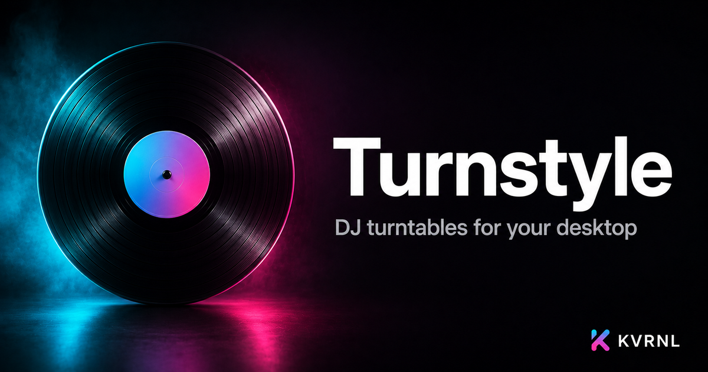

# Turnstyle

### DJ turntables for your desktop

 

Two decks, a crossfader, EQ, and real-time mixing — a full DJ turntable rig that runs natively on your machine. Load tracks, beatmatch, scratch, and perform.

### **[⬇&nbsp; Download Turnstyle — free at kvrnl.io](https://kvrnl.io/products/turnstyle/)**

 

---

## What it does

Turnstyle is a desktop DJ app with twin virtual turntables. Drop a track onto each deck, watch the platters spin, and mix with a smooth equal-power crossfader. Drag the vinyl to scratch, ride the pitch fader to beatmatch, and shape each channel with a 3-band EQ.

Every track gets a live waveform you can click to seek, a BPM estimate, and one-click SYNC to beatmatch the second deck. It all runs locally and offline — no streaming, no accounts for your music. Free to use; claim your license key and download it straight from this page.

## Features

- **Dual decks with jog/scratch, cue points & spinning platters**
- **Per-channel 3-band EQ + equal-power crossfader**
- **Pitch/tempo fader with BPM estimate & one-click SYNC**
- **Live waveforms, drag-and-drop loading, runs fully offline**

## Download &amp; install

Turnstyle is **completely free**. Each install needs its own license key, which you get
with a free KVRNL account.

1. Go to **[kvrnl.io/products/turnstyle/](https://kvrnl.io/products/turnstyle/)**
2. Create a free account — email verification, nothing else
3. Claim your license key — instant, no waiting
4. Download and install

> [!NOTE]
> Turnstyle isn't code-signed yet, so Windows SmartScreen may warn you on first run.
> Click **More info → Run anyway**. Code signing is on the roadmap.

## Your license key

- **Free, one per product**, issued from your KVRNL account.
- **A key activates on one machine.** The first device to activate it claims it.
- **Switching computers?** Hit **Release device** on your
  [account page](https://kvrnl.io/account/) and the key is free to use again.
- Keys are checked over HTTPS at launch. See [Privacy](#privacy).

## Requirements

- **Windows 10 or 11** (64-bit)
- A free [KVRNL account](https://kvrnl.io/signup/) for your license key

## Privacy

Turnstyle sends KVRNL only what's needed to validate your license: **the key, the
product name, and a hardware ID**. No telemetry, no analytics, no tracking, and
none of your files. Full policy: **[kvrnl.io/privacy](https://kvrnl.io/privacy/)**

## What's new

**v1.0.11** — 2026-09-25
  - A brand-new activation window: paste your key (there's a Paste button), press Activate, and clear messages tell you exactly what to do if something's wrong.
  - New to Turnstyle? The activation window now walks you through getting your free key: create a free KVRNL account, claim Turnstyle, then paste the key. A button takes you straight there, and it works the same wherever you downloaded Turnstyle from.
  - At startup, Turnstyle now tells you when it's checking your license instead of showing nothing.
  - If KVRNL's servers are busy or down, Turnstyle keeps working and simply checks again later. It no longer mistakes an outage for an invalid key.
  - Keys are tidied up for you when you paste them: extra spaces, line breaks, odd dashes and words copied along with the key are ignored.
  - Stronger license protection, so every copy of Turnstyle is properly activated.

**v1.0.10** — 2026-09-25
  - Your cue points now stick: the cue point, hot cues and any BPM fixes are saved for every track, so a track you've prepared comes back ready to play. Set a hot cue while a loop is running and the pad saves the loop (it lights amber) — press it to jump straight back into that loop.
  - Headphone cueing: press the headphone button under a channel on the mixer to hear that deck before the crowd does. Pick your speakers and headphones in Settings › Audio & Decks, or choose Split to use one pair of headphones — the deck you're cueing in one ear, the mix in the other. CUE/MIX and PHONES knobs set what you hear and how loud.
  - Smarter beatmatching: every deck has its own SYNC, and it now lines up the beats as well as the tempo. TAP along to set the BPM by hand, ÷2 and ×2 fix a BPM that reads half or double speed, the − and + buttons nudge a deck to line up beats by ear, and a light by the BPM flashes on every beat. Tempo detection is more accurate too.
  - Real scratching: drag the platter and you hear the record move with your hand — forwards, backwards, fast or slow — and when you let go it carries on right in time. New BRAKE and BACKSPIN buttons stop a track like a real turntable.
  - Auto DJ: press “+ Up Next” on tracks in your library and switch on AUTO DJ — Turnstyle mixes them for you, loading each next track, matching the tempo, lining up the beats and crossfading at the end. Grab the crossfader any time to take over, and set the transition length in Settings.
  - New keyboard shortcuts: W and O sync, Z/X and ,/. nudge the pitch, 1–4 and 7–0 fire hot cues (Shift clears one), and T taps the tempo. The full list is in Settings › Keyboard.
  - Jumping to a cue or hot cue is now click-free, and the record on the platter stays where it stopped when you pause instead of jumping back.

**v1.0.9** — 2026-09-06
  - The whole rig has been relaid out so everything fits on screen at any window size — no more controls hiding under the library bar — and the platters grow to fill bigger displays.
  - Real rotary knobs for Gain, EQ, Filter and FX Wet: drag up or down, hold Shift for fine control, scroll to nudge, double-click to reset. The label shows the exact value while you turn it.
  - A proper mixer strip in the middle: channel faders for A and B either side of a Master fader, with segmented VU meters, SYNC and the crossfader below.
  - Vertical pitch faders beside each platter, with a centre mark and a Reset button. Top is slower, bottom is faster, like the real thing.
  - Hot cues and beat loops now sit side by side, the track clock is overlaid on the waveform, and the deck you're controlling with the keyboard is highlighted.

**v1.0.8** — 2026-09-06
  - Settings has been rebuilt from the ground up: sections down the left side (General, Audio & Decks, Controllers, Keyboard, Account, Support, About), status lights that show what's going on, and every change saves the moment you make it.
  - New Audio & Decks settings: pick a crossfader curve (Smooth for long blends, Linear, or Cut for scratching), choose the pitch range (±8%, ±16% or ±50%), and set the master volume. All three are remembered between sessions.
  - Updates now show a download progress bar, and the settings gear lights up when a new version is ready to install.
  - A Keyboard page lists every shortcut and mouse gesture, and Account shows your license status at a glance.
  - About now shows What's New — the release notes for every version, with the one you're on marked.

**v1.0.7** — 2026-09-05
  - Fixed the pitch fader drifting the playhead: moving pitch while a track played threw off the waveform position and time display, and pause/resume could jump.
  - SYNC now matches deck B to deck A's actual playing tempo, including A's pitch setting, so the decks really line up.
  - Keyboard shortcuts no longer fire while typing in the Report a Problem form or while Settings is open, and holding a key no longer stutters play or cue.
  - The CUE button no longer sticks lit after using the A or L keys, and jumping to cue now leaves an active loop like hot cues do.
  - Dropping a track just outside a deck no longer replaces the app with a blank file page.
  - If an update finishes downloading before the app opens, Settings now shows Restart & Install right away.

Full history → **[kvrnl.io/changelog/turnstyle](https://kvrnl.io/changelog/turnstyle/)**

## Documentation

Setup guides and how-tos → **[kvrnl.io/docs/turnstyle](https://kvrnl.io/docs/turnstyle/)**

## Support

> [!IMPORTANT]
> **We don't use GitHub Issues.** Report bugs from inside the app — it's the
> fastest route to us and it attaches the details we need automatically.

- 🐛 **Found a bug?** Use **Report a Problem** inside Turnstyle
- 💬 **Chat with us** → **[Discord](https://discord.gg/Ub4SdAuhu)**
- ✉️ **Anything else** → **[kvrnl.io/contact](https://kvrnl.io/contact/)**
- ❓ **FAQ** → [kvrnl.io/faq](https://kvrnl.io/faq/)

## License

**Proprietary freeware — free to use, not open source.**

This repository hosts the installer releases, documentation, and license for
Turnstyle. **The application source code is not published.** See
**[LICENSE](./LICENSE)** for the full terms.

---

 

**[kvrnl.io](https://kvrnl.io)** &nbsp;·&nbsp; **[All products](https://kvrnl.io/products/)** &nbsp;·&nbsp; **[Changelog](https://kvrnl.io/changelog/)** &nbsp;·&nbsp; **[Discord](https://discord.gg/Ub4SdAuhu)** &nbsp;·&nbsp; **[Contact](https://kvrnl.io/contact/)**

© 2026 <b>KVRNL</b> — an AI-powered software studio shipping free desktop tools.

